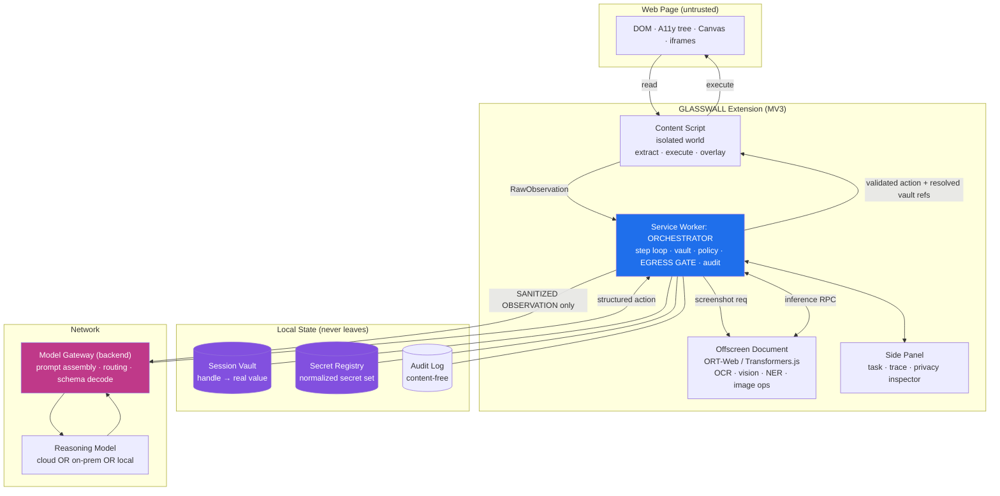
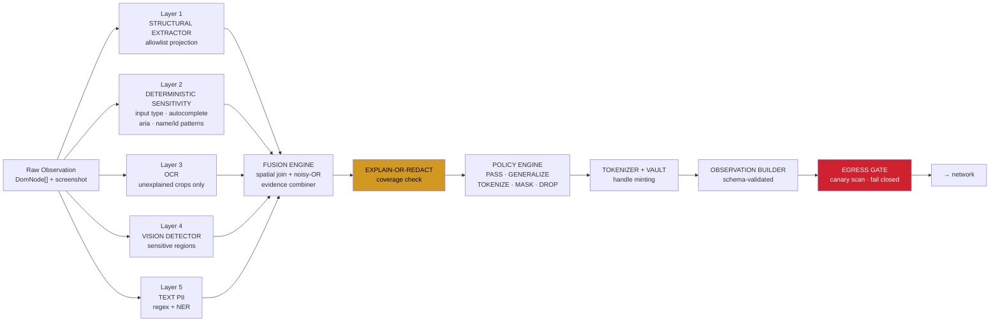
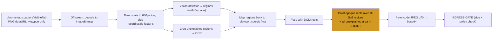

# ARCHITECTURE.md — Component Map & Data Flow

**GLASSWALL** — Privacy-preserving Runtime for Agent–Host Reasoning Interfaces  
SIH26171 · ISRO

---

## 1. Component Map



### Component Responsibilities

| Component | Owns | Explicitly Does NOT Own |
|-----------|------|------------------------|
| **Content Script** | DOM/A11y traversal, geometry, element identity, action execution, on-page overlay | Any network I/O, any model inference, any policy decision |
| **Offscreen Document** | All local model inference (ORT-Web/Transformers.js), image processing, canvas ops | Network I/O, Chrome APIs beyond `chrome.runtime` |
| **Service Worker (Orchestrator)** | Step loop, vault, secret registry, policy engine, egress gate, audit log, session state | DOM access, heavy compute |
| **Side Panel (UI)** | Task input, live trace, privacy inspector, confirmations, settings | Any bypass of the gate |
| **Backend Gateway** | Prompt assembly from sanitized observation, model routing, schema-constrained decoding, response validation, rate limits | Storing observations, any de-anonymization, cannot dereference handles |
| **Remote Reasoner (LLM/VLM)** | Choosing next action from sanitized observation | Executing anything, seeing any real value, enforcing privacy |

---

## 2. Data Flow — The Five Stages

```mermaid
sequenceDiagram
    autonumber
    participant U as User
    participant UI as Side Panel
    participant SW as Orchestrator (SW)
    participant CS as Content Script
    participant OFF as Offscreen (models)
    participant GW as Gateway
    participant M as Reasoner

    U->>UI: task = "Fill the shipping form and submit"
    UI->>SW: START_SESSION(task)
    SW->>SW: scan task for PII → tokenize → register secrets

    rect rgb(232, 244, 255)
    Note over SW,OFF: A. OBSERVATION
    SW->>CS: CAPTURE(observation_id)
    CS->>CS: DOM walk + A11y + geometry (allowlist projection)
    CS-->>SW: RawObservation (stays local)
    SW->>OFF: SCREENSHOT_PROCESS(dataUrl)
    OFF-->>SW: downscaled tensor + region index
    end

    rect rgb(255, 244, 230)
    Note over SW,OFF: B. SANITIZATION
    SW->>OFF: DETECT(text spans, crops, screenshot)
    OFF-->>SW: {ner_spans, ocr_regions, vision_regions}
    SW->>SW: FUSE → EXPLAIN-OR-REDACT → POLICY → TOKENIZE(vault)
    SW->>SW: build SanitizedObservation (JSON-Schema validated)
    SW->>SW: EGRESS GATE: canary scan · encoded-form scan · size check
    end

    rect rgb(240, 255, 240)
    Note over SW,M: C. REASONING
    SW->>GW: POST /v1/step {sanitized_observation, task, history}
    GW->>M: prompt + constrained action schema
    M-->>GW: Action JSON
    GW->>GW: validate against schema, repair once, else error
    GW-->>SW: Action
    end

    rect rgb(255, 240, 245)
    Note over SW,CS: D. ACTION
    SW->>SW: VALIDATE(action): schema · freshness · identity hash · risk
    alt risk == HIGH
        SW->>UI: request confirmation
        U-->>UI: approve / deny
    end
    SW->>SW: resolve @vault refs (locally, type-matched)
    SW->>CS: EXECUTE(validated action)
    CS->>CS: scroll into view · dispatch trusted-ish events · verify effect
    CS-->>SW: ActionResult {ok, effect_observed, error_code}
    end

    rect rgb(232, 244, 255)
    Note over SW,CS: E. RE-OBSERVATION
    SW->>CS: WAIT_STABLE(timeout) then CAPTURE(next)
    Note over SW: loop to A until DONE / budget / abort
    end

    SW->>UI: trace + audit record per step
```

---

## 3. The Boundary Contract — What Crosses, What Never Crosses

### MAY cross the network (allowlist — if not on this list, it does not go)

| Field | Sanitization Applied |
|-------|---------------------|
| `session_id`, `step_index`, `observation_id` | Random UUIDs, no derivation from content |
| `task` | Scanned & tokenized like page text |
| `page.origin_class` | `internal` \| `external` \| `benchmark` — **not the URL** |
| `page.url_template` | Path with numeric/UUID/hash segments generalized: `/orders/{id}/tracking`. Query & fragment **dropped entirely** |
| `page.title` | Tokenized |
| `page.type_hint` | Enum from local classifier: `form` \| `list` \| `detail` \| `auth` \| `checkout` \| `search` \| `other` |
| `viewport` | `{w, h, scroll_y_pct, doc_h_ratio}` — quantized |
| `elements[]` | `{id, id_hash, role, tag, type, label*, placeholder*, rect_q, visible, enabled, value_state, sensitivity_class, options_count, group}` where `*` = tokenized |
| `text_blocks[]` | Tokenized text with handles, ≤ N chars, ordered by reading order |
| `handles[]` | `{handle, type, count, first_seen_step}` — **type and cardinality only, never value** |
| `available_actions[]` | Derived affordances per element |
| `screenshot_redacted` | Optional. Downscaled, boxes painted opaque, JPEG q≈70. **Off in STRICT.** |
| `history[]` | Prior sanitized actions + result codes |
| `budget` | `{steps_left, ms_left}` |

### MUST NEVER cross (denylist — enforced structurally, then re-checked at the gate)

- Raw HTML or any serialized DOM
- `element.value` / `input.value` / `textarea.value` for any field
- `document.cookie`, `localStorage`, `sessionStorage`, IndexedDB
- Unredacted screenshot bytes or crops
- Raw OCR strings
- Vault contents
- Secret registry contents
- Full URLs with query/fragment/path identifiers
- `Authorization` headers or any credential
- File contents
- Clipboard
- Browsing history
- Other tabs
- User agent beyond coarse capability class
- Precise timing traces

> **Implementation note:** the denylist exists as documentation and as a _second_ check. The _first_ and real defense is that the Sanitized Observation is built by an allowlist projection function whose output type has no field capable of holding these things. Type systems are cheaper than vigilance.

---

## 4. Perception & Sanitization Pipeline (Inside Extension)



### Layer Responsibilities

**Layer 1 — Structural Extractor (allowlist projection)**
- Walks DOM/A11y tree and emits per element _only_ fields from fixed vocabulary: `{id, role, tag, type, label, placeholder, rect, visible, enabled, focusable, value_state, options_count, group_path}`
- **Never reads** `.value`, `.innerHTML`, `.textContent` of non-allowlisted nodes, or attributes outside the allowlist
- **This is where G1 (structural containment) comes from.** The extractor is the security boundary, not the redactor.

**Layer 2 — Deterministic Sensitivity**
- High-precision rules needing no model: `input[type=password|tel|email]`, `autocomplete` tokens (`cc-number`, `cc-csc`, `street-address`, `postal-code`, `bday`, `one-time-code`, ...), `aria-label`/`name`/`id`/`for` regex families, `inputmode`, `<label>` proximity, form-section headings
- Returns a **prior** in `[0,1]` with a rule id for auditability
- Carries most real-world recall for form fields, nearly free

**Layer 3 — OCR (targeted, not global)**
- Runs only on regions DOM cannot explain: `<canvas>`, `` bounding boxes, `<svg>` with embedded `<text>` we cannot read, cross-origin iframe rects, video posters
- **We do not OCR the whole page** — that is the mistake that makes browser OCR slow
- Budget: ≤ 6 crops/step, ≤ 512 px longest side each

**Layer 4 — Vision Sensitive-Region Detector**
- Small ONNX detector on downscaled screenshot
- Classes: `pii_text`, `input_field`, `person_image`, `document_image`, `code_or_id`
- Independent of DOM by design — catches PII DOM cannot see

**Layer 5 — Text PII**
- (a) **Deterministic recognizers**: email, phone (E.164 + Indian formats), PAN, Aadhaar (12-digit + Verhoeff), IFSC, GSTIN, credit card (Luhn), IPv4/6, UPI VPA, DOB patterns, API-key shapes
- (b) **NER token classifier** in ORT-Web for names, addresses, organizations, contextual cases

**Fusion Engine**
- Spatial join in viewport coordinates
- Per-region evidence combination via noisy-OR:
  ```
  S(region) = 1 − Π_i (1 − w_i · c_i)
  ```
  with source weights `w` calibrated on held-out split, `c` per-source confidence
- Monotone: adding evidence never decreases suspicion
- **Fails toward privacy** — one strong signal is enough

**Explain-or-Redact Coverage Check**
- Union of rects for elements extractor emitted with known-low sensitivity
- Any screenshot region or OCR text span _outside_ that union = `unexplained` → sensitivity `S = policy.unexplained_prior` (default 0.8 STRICT, 0.4 BALANCED)
- Turns "we might have missed something" into "we withheld what we could not account for"

**Policy Engine** — See `PLAN.md` §11.4

**Egress Gate** — See §11.6. Single choke point; nothing else may call `fetch`. Enforced by ESLint rule + CI grep.

---

## 5. Screenshot Data Flow



**Critical ordering rule:** redaction applied to _pixel buffer inside offscreen document_; original `ImageBitmap`/dataURL dropped before redacted version handed to orchestrator. Unredacted bytes never reachable from gate code path. Enforced by module boundary: `offscreen/vision/redact.ts` only module returning image bytes to orchestrator, return type is `RedactedImage` (branded).

---

## 6. Contracts (C1–C10)

| Contract | Producer | Consumer | Key Types |
|----------|----------|----------|-----------|
| **C1** `RawObservation` | A (content script) | B (sanitize) | `RawObservation`, `RawElement`, `RawTextNode`, `CapturedFrame` |
| **C2** `CapturedFrame` | A (SW capture) | B (offscreen) | `ImageBitmap` (transferable), `dpr`, `viewport_w/h`, `stale` |
| **C3** `InferenceHost` RPC | A (hosts) | B (implements) | `init`, `load`, `run`, `bench` |
| **C4** `sanitize()` | B (single entry) | A (calls) | `RawObservation` + `CapturedFrame` + `task` + `step` + `session` → `SanitizeResult` |
| **C5** `SanitizedObservation` | B (produces) | A (transmits) | Schema-validated, `additionalProperties: false` |
| **C6** `egressGate()` | B (function) | A (`net.ts` only) | `SafePayload` branded type, fail-closed |
| **C7** `resolveForBinding()` | B (function) | A (before TYPE) | `Sensitive<string>` branded, `toString()` = `"[redacted]"` |
| **C8** Validator rungs 7&8 | B (functions) | A (ladder) | `checkVaultTypeMatch`, `scanLiteralAgainstRegistry` |
| **C9** `AuditRecord` | Split (A+B) | A (assembles) | Content-free, no field capable of holding value |
| **C10** Bench-site instrumentation | B (specifies) | A (applies) | `data-glasswall-pii`, `data-glasswall-tier`, `data-glasswall-value-id` |

**Contract change protocol:** PR touching only `packages/schema` titled `contract: ...`; additive-only after freeze dates; both run `pnpm gen:schema` after merge; CI fails if generated JSON stale.

---

## 7. MV3 Inference Placement

```
SW  ──postMessage──►  Offscreen Document
                        └─► (if required) sandboxed iframe
                              └─► ORT-Web session (webgpu | wasm)
```

**Constraint chain:**
1. MV3 service workers cannot create Web Workers → ORT-Web multithreading cannot run in SW
2. Workaround: **offscreen document** (reason: `WORKERS` / `DOM_SCRAPING` / `BLOBS`)
3. Even in offscreen, ORT-Web worker creation can violate extension CSP → **sandboxed iframe** inside offscreen page
4. WebGPU availability in extension contexts improved (Chrome ≥ 124) — **verify on demo machine**

**Decision:** all inference in offscreen document behind single RPC interface `InferenceHost`. Sandboxed-iframe workaround hidden behind that interface.

---

## 8. Model Caching Strategy

- Models **bundled in extension package** where size permits (OCR + detector + int8 NER ≈ 60–80 MB target) → demo works with **zero network**
- Anything above bundle budget fetched once to **Cache Storage / OPFS** with integrity hash
- `MODEL_MANIFEST.json` pins name, sha256, size, EP support, license
- Evaluator reads it so model card and benchmark cannot drift apart

---

## 9. Storage Architecture

| Store | Purpose | Lifetime | Contents |
|-------|---------|----------|----------|
| `chrome.storage.session` | Vault, secret registry, session state | Browser session (cleared on close) | Handle→value, normalized secrets, step index, budget, sanitized memory |
| `chrome.storage.local` | Settings, model cache metadata | Persistent | Policy profile, model versions, EP preference |
| Cache API / OPFS | Model binaries | Persistent | ONNX models, tokenizer files |

**Vault design:** session-salted handles via `HMAC(session_salt, normalize(value))` truncated. Salted so handles not rainbow-table oracle; per-session so cross-session linkage impossible; deterministic within session so referential consistency holds.

---

## 10. Action Protocol

### Action Types (11)
`CLICK`, `TYPE`, `SCROLL`, `SELECT`, `PRESS_KEY`, `NAVIGATE`, `WAIT`, `BACK`, `DONE`, `ASK_USER`, `SUBMIT_LIKE`

### Event Ordering (critical)
```
CLICK: pointerdown → mousedown → focus → pointerup → mouseup → click
TYPE : focus → (select-all + Delete if clear_first) → per-char keydown/keypress/input/keyup → change → blur
```

### Native Value Setter (required for React/Vue controlled components)
```typescript
Object.getOwnPropertyDescriptor(HTMLInputElement.prototype, 'value').set.call(element, value);
```

### 12-Rung Validation Ladder
1. Schema valid (Zod)
2. Fresh observation_id matches
3. Target exists in current observation
4. Target visible & enabled
5. Action supported by target (available_actions)
6. Origin allowed (for NAVIGATE)
7. **VAULT_TYPE_MISMATCH** — vault handle type matches target sensitivity class (C8)
8. **LITERAL_CONTAINS_SECRET** — no raw secrets in literal values (C8)
9. Risk classification → confirmation if HIGH
10. IDENTITY_MISMATCH check at execution (re-compute id_hash)
11. Effect verification (DOM mutation / navigation / scroll)
12. Loop/oscillation detector

---

## 11. Failure Modes & Mitigations (Chaos Suite)

| # | Failure | Detection | Mitigation | Fallback | User Sees |
|---|---------|-----------|------------|----------|-----------|
| F1 | PII missed by all detectors | Canary harness | Explain-or-redact withholds unaccounted content | Region masked as unexplained | "N regions withheld (unverified)" |
| F2 | Over-redaction breaks task | Completion drops | Switch to BALANCED; tune thresholds | Agent emits `ASK_USER` | "Agent needs your input for ⟨field⟩" |
| F3 | OCR fails/times out | 800ms timeout | Region → unexplained → masked | tesseract.js; then mask | "Image content withheld" |
| F4 | WebGPU unavailable | `capability.probe()` | Auto WASM fallback | Single-threaded WASM | Badge: "CPU mode — slower" |
| F6 | Model fails to load | Load error/hash mismatch | Circuit breaker disables source | Source's regions → unexplained | "Vision disabled — stricter redaction" |
| F11 | Agent emits invalid action | Validator ladder | Return error as history; one repair retry | Recovery ladder → `SCROLL` → `ASK_USER` → abort | "Retrying (2/3)" |
| F14 | Network unavailable | Fetch failure | Retry ×2 with backoff | Scripted planner / local Ollama | "Offline — using local planner" |
| F17 | SW killed (MV3) | Missing state on wake | Persist step state to `storage.session` after **every step** | Resume from last step | Transparent |
| F18 | Prompt injection in page | T7 test; anomaly detector | Structured obs, provenance wrapping, validator, type-matched binding | Block + log + notify | "⚠️ Page attempted to instruct agent — blocked" |
| F20 | Vault type mismatch | Validator step 7 | Hard block + audit entry | Step aborts | "⚠️ Blocked attempt to place sensitive data in unrelated field" |

**Cross-cutting invariant:** in **every** degraded mode, chaos suite asserts **leakage = 0**. Degradation may cost utility. It may never cost privacy.

---

## 12. Recovery & Circuit Breakers (PHASE 14)

### Recovery Ladder (`apps/extension/src/background/recovery.ts`)
- Capped at 3 attempts per step, then abort
- Strategies by error code:
  - `ELEMENT_NOT_FOUND` / `STALE_OBSERVATION` → `SCROLL` → re-observe
  - `UNSUPPORTED_ACTION` → alternative action
  - `IDENTITY_MISMATCH` → `WAIT` → re-observe
  - Security failures (`VAULT_TYPE_MISMATCH`, `EGRESS_GATE_VIOLATION`) → **no recovery, abort**

### Circuit Breakers (`apps/extension/src/background/circuit-breaker.ts`)
- Per subsystem: 3 failures → disable that source, mark its regions unexplained, continue
- 60s cooldown before re-enable (half-open test)
- Subsystems: `vision`, `ocr`, `ner`, `deterministic`, `fusion`, `policy`, `egress`, `vault`, `executor`

### Session Persistence (`apps/extension/src/background/persist.ts`)
- Persist step state to `chrome.storage.session` after **EVERY SINGLE STEP**
- On SW restart: restore session, re-initialize secret registry, continue from last step
- Transparent to user

---

## 13. Error Taxonomy (User-Facing)

`apps/extension/src/sidepanel/ErrorState.tsx` — actionable copy for every error code:

| Category | Codes | Example |
|----------|-------|---------|
| Perception | `CAPTURE_FAILED`, `ELEMENT_NOT_FOUND`, `STALE_OBSERVATION` | "Target Element Not Found — Re-observe Page" |
| Sanitization | `SANITIZATION_TIMEOUT`, `VISION_DISABLED`, `OCR_FAILED` | "Vision Detector Disabled — Stricter Redaction Active" |
| Network | `NETWORK_UNAVAILABLE`, `BACKEND_ERROR`, `PROVIDER_RATE_LIMITED` | "Network Unavailable — Using Local Planner" |
| Execution | `EXECUTION_FAILED`, `ELEMENT_NOT_ACTIONABLE`, `IDENTITY_MISMATCH` | "Element Not Interactable — Scroll to Element" |
| Validation | `VAULT_TYPE_MISMATCH`, `LITERAL_CONTAINS_SECRET`, `EGRESS_GATE_VIOLATION` | "Blocked: Type Mismatch in Vault Binding — View Audit Log" |
| System | `BUDGET_EXHAUSTED`, `CONSECUTIVE_FAILURES`, `SERVICE_WORKER_RESTARTED` | "Too Many Consecutive Failures — Restart Task" |

Severities: `info` (blue), `warning` (amber), `error` (red), `critical` (red + pulse). Minimum 14px, high contrast for projector.

---

## 14. Demo Polish (PHASE 15)

- **Reset Demo Button** — One click restores bench sites + extension to known state (`apps/bench-site/src/components/ResetDemoButton.tsx`)
- **Trace/Inspector Layout** — Projector legibility: ≥14px, high contrast, larger touch targets (`Trace.tsx`, `ErrorState.tsx`)
- **Backup Videos** — Every beat recorded, on desktop, one click away
- **Second Laptop** — Identical state, extension pre-loaded

---

## 15. ADR Index

| ADR | Decision | Date |
|-----|----------|------|
| ADR-001 | Inference in offscreen document + sandboxed iframe | Day 1 |
| ADR-002 | Allowlist projection (Layer 1) as privacy boundary | Day 2 |
| ADR-003 | Vault-referenced deferred value binding | Day 3 |
| ADR-004 | Single egress gate with branded SafePayload | Day 4 |
| ADR-005 | Noisy-OR fusion with calibrated weights | Day 6 |
| ADR-006 | Explain-or-redact coverage check | Day 7 |
| ADR-007 | Circuit breakers per perception subsystem | Day 10 |
| ADR-008 | Session persistence to storage.session every step | Day 10 |

See `docs/decisions/ADR-*.md` for full records.

---

## 16. Key Files by Layer

```
apps/extension/src/
├── background/
│   ├── orchestrator.ts      # Step loop, recovery, circuit breakers, persistence
│   ├── net.ts               # ONLY fetch in repo; send(SafePayload)
│   ├── capture.ts           # screenshot capture → offscreen
│   ├── recovery.ts          # Recovery ladder (3 attempts max)
│   ├── circuit-breaker.ts   # Per-subsystem breakers
│   └── persist.ts           # Session persistence after every step
├── content/
│   ├── extractor/           # DOM/A11y walk, allowlist projection, geometry
│   │   ├── walk.ts
│   │   ├── a11y.ts
│   │   └── stability.ts
│   └── executor/            # Action execution, native value setter, effect verification
│       ├── click.ts
│       ├── type.ts
│       └── verify.ts
├── offscreen/
│   ├── host.ts              # Offscreen document lifecycle + RPC
│   └── pipeline/            # B's handlers (image/, ocr.ts, ner.ts, vision.ts)
└── sidepanel/
    ├── Trace.tsx            # Live trace: latency breakdown, degraded, redactions
    ├── Confirm.tsx          # High-risk action confirmation
    ├── ErrorState.tsx       # Error taxonomy with actionable copy
    └── App.tsx              # Main shell + task input
```

---

## 17. Build & Deploy

```bash
# Development
pnpm dev                    # All packages with HMR

# Production build
pnpm build                  # TypeScript + Vite for all packages

# Extension bundle
pnpm --filter @glasswall/extension build
# Output: apps/extension/dist/ → load unpacked in chrome://extensions

# Bench sites
pnpm --filter @glasswall/bench-site build
# Output: apps/bench-site/dist/ → static files, serve locally

# Backend
pnpm --filter @glasswall/backend build
# Output: apps/backend/dist/ → node server
```

---

## 18. Security & Privacy Guarantees

| Guarantee | Mechanism | Verified By |
|-----------|-----------|-------------|
| **G1** Structural containment | Allowlist projection (Layer 1); output type has no raw fields | Extractor grep test (CI) |
| **G2** Value non-disclosure | Egress gate scans for secret registry values in raw/normalized/encoded forms | Canary harness (CI) |
| **G3** Single egress | Manifest CSP `connect-src` pinned; only `net.ts` calls `fetch` | ESLint `no-restricted-globals` + CI grep |
| **G4** Action containment | 12-rung validator; no path from model output to `eval`/`Function`/`innerHTML` | CI grep + rejection matrix test |
| **G5** Auditability | Content-free audit record per step | Schema validation + manual inspection |

**Non-guarantees (explicit):** N1–N5 in `SECURITY.md` — perfect recall, non-inference, malicious-page immunity, malicious reasoner, side channels.

---

*Generated from `PLAN.md` §6.1, §7.1 and implementation. Keep in sync with code.*