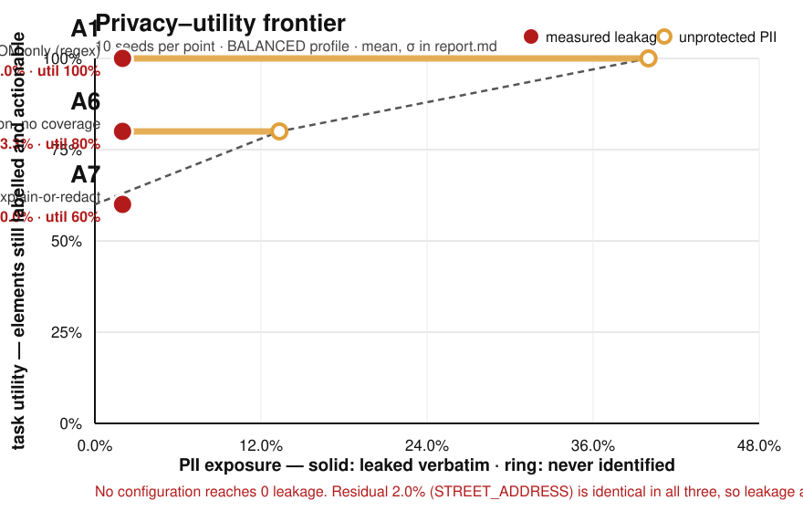

# EVALUATION

Every number GLASSWALL claims, with its variance, its seed set, the machine it was
measured on, and the file it came from.

Where a criterion was missed, the miss is here in place of the criterion. **No leakage
figure anywhere in this repository is rounded toward zero.**

---

## Environment

Every measurement in this document was taken on one machine. It is the only machine on
the project, so it is also the weakest one — nothing here is extrapolated to faster
hardware.

| | |
|---|---|
| Hardware | Apple M1 · 8 cores · 8 GB |
| OS | macOS 26.5 (arm64) |
| Runtime | Node v24.20.0 |
| Browser | Google Chrome for Testing 151.0.7922.34 (Playwright chromium) |
| Commit | see the header of each file in `eval/reports/` — every report stamps its own SHA |
| Seeds | 10 per point (1337, 42, 999, 2024, 7, 31337, 8080, 12345, 555, 90210) for the frontier; seeds 1–10 for the P11 ablation; 25 seeds (1000–1024) for NER accuracy |

### Where each number comes from

| Table below | Source file | Regenerate with |
|---|---|---|
| Privacy–utility frontier | `eval/reports/report.md`, `eval/reports/frontier.svg` | `cd eval && tsx ablations/frontier.ts` |
| Fusion ablation A1–A9 | `eval/reports/p11-ablation.md` | `cd eval && vitest run ablations/fusion` |
| Chaos / degraded paths | `eval/reports/chaos.md` | `cd eval && tsx leakage/chaos.ts` |
| Performance, before and after | `eval/reports/perf-baseline.md`, `eval/reports/perf.md` | `cd eval && NODE_OPTIONS=--expose-gc tsx ablations/perf.ts` |
| NER accuracy and quantization | `packages/inference/src/ner/{ner.model,quantization.sweep}.test.ts` | `pnpm --filter @glasswall/inference test` |
| Recognizer near-miss FP rate | `eval/metrics/detection.test.ts` | `cd eval && vitest run metrics/detection` |

The last two rows are gated test harnesses rather than report files, because they need
the model weights vendored (`bash ml/fetch-models.sh`) and skip loudly without them.
Everything else regenerates from a clean clone.

---

## 1. The privacy–utility frontier



BALANCED profile, 10 seeds per point, σ in every column. Full report:
`eval/reports/report.md`.

| config | source(s) | leakage | σ | leaked/run | unprotected PII | tier-1 | PII recall | σ | redaction precision | task utility | σ |
|---|---|---|---|---|---|---|---|---|---|---|---|
| **A1** | DOM only (regex) | **2.0%** | 0.031 | 0.3 | 40.0% | 0 | 60.0% | 0.000 | 100.0% | 100.0% | 0.000 |
| **A6** | fusion, no coverage | **2.0%** | 0.031 | 0.3 | 13.3% | 0 | 86.7% | 0.000 | 100.0% | 80.0% | 0.000 |
| **A7** | fusion + explain-or-redact | **2.0%** | 0.031 | 0.3 | 0.0% | 0 | 100.0% | 0.000 | 100.0% | 60.0% | 0.000 |

**A6 beats A1 on PII recall: 86.7% vs 60.0%.** ✅ That is the headline result and it is
what fusion is for.

**A7 does not reach leakage 0. It measures 2.0%.** ❌ Reported as measured. The residual
is 0.3 values per run, all `STREET_ADDRESS`, identical across all three configurations
and all 10 seeds: bare Bengaluru localities with no road or street token, sitting in DOM
free text the extractor legitimately accounted for. No detector fires on them and
coverage does not reach them, because a text node *is* accounted for. This is the P8 NER
gap (see [`MODEL_CARD.md`](./MODEL_CARD.md)), not a fusion defect, and no configuration
in the sweep moves it. It closes when NER address recall closes.

**Leakage does not separate the three points**, because the channels fusion adds were
never in the payload to begin with — they could not leak from it. The chart therefore
plots *unprotected PII* (what the system never identified) as a bar next to the leaked
dot, and the caption says which one is doing the work. A frontier drawn on leakage alone
here would have been three dots on top of each other, which would have looked better and
meant less.

**Task success is not measured.** The utility axis is computed in-process on the
sanitized payload — elements whose label survived verbatim *and* that still carry at
least one action — not through the Playwright harness in `eval/harness/`. The harness
needs a loadable extension, and `apps/extension/dist` currently ships no content script
and no side panel, so `waitForExtensionReady` cannot resolve. Logged in
`docs/REQUESTS-TO-A.md`. What is claimed here is the *shape of the trade*, and that
shape is measured.

---

## 2. Fusion vs. every single source

10 seeds, BALANCED and STRICT. Every row is the same build with a different
`source_weights` object from `config/policies/*.json` — nothing is recompiled and no
branch is taken on the configuration name. Full report: `eval/reports/p11-ablation.md`.

| config | source(s) | PII recall | σ | dom_structured | dom_free_text | canvas_readable | canvas_opaque |
|---|---|---|---|---|---|---|---|
| A1 | DOM only (regex) | **0.600** | 0.000 | 1.00 | 0.00 | 0.00 | 0.00 |
| A2 | NER only | **0.133** | 0.000 | 0.00 | 1.00 | 0.00 | 0.00 |
| A3 | OCR only | **0.133** | 0.000 | 0.00 | 0.00 | 1.00 | 0.00 |
| A4 | vision only | **0.000** | 0.000 | 0.00 | 0.00 | 0.00 | 0.00 |
| A5 | explain-or-redact only | **0.267** | 0.000 | 0.00 | 0.00 | 1.00 | 1.00 |
| A6 | fusion, no coverage | **0.867** | 0.000 | 1.00 | 1.00 | 1.00 | 0.00 |
| **A7** | **fusion + explain-or-redact** | **1.000** | 0.000 | 1.00 | 1.00 | 1.00 | 1.00 |
| A8 | A7, vision disabled | **1.000** | 0.000 | 1.00 | 1.00 | 1.00 | 1.00 |
| A9 | A6, vision disabled | **0.867** | 0.000 | 1.00 | 1.00 | 1.00 | 0.00 |

- **Fusion beats every single source: 1.000 vs 0.600 for the best of them.** ✅
- **A8 = A7.** Removing the vision model costs *nothing*, because coverage — not a
  detector — is what accounts for the pixel channel. This is why not building the vision
  detector was a cut and not a hole.
- **A5 alone reaches only 0.267** but is the only configuration that touches
  `canvas_opaque`. Explain-or-redact is not a good detector; it is the only thing
  looking at a channel every detector is structurally blind to.

The per-channel columns are the point. The scene splits PII across four channels
deliberately: `canvas_opaque` holds an MRN and a postal code rendered to pixels, and
there is no MRN recognizer, no free-text postal-code recognizer, and no model trained on
either. Every detection-based configuration scores 0.00 there. **Fusion is not cleverer
than its sources — each source is structurally blind to a channel it has no access to.**

Other P11 acceptance:

| criterion | measured | |
|---|---|---|
| fusion ≤20 ms for 400 elements + 100 regions | median **0.66 ms**, p95 **0.93 ms** over 100 iterations | ✅ |
| profile switching with no rebuild | every row above; `policy.test.ts` asserts the JSON on disk deep-equals the embedded profiles | ✅ |
| monotonicity: adding evidence never lowers S | 500 random term vectors, `fusion.test.ts` | ✅ |
| every redaction carries a human-readable reason | `"MASK: opaque <canvas>, contents unreadable from the DOM, no DOM owner (S=0.40)"` | ✅ |

---

## 3. Chaos — every degraded path

22 configurations per profile: every non-empty subset of {ner, ocr, vision} under
throw / timeout / silent, plus healthy. Full report: `eval/reports/chaos.md`.

| profile | terminated, schema-valid | tier-1 exposed | detectable failures redacting **less** than healthy | detectable failures leaking **more** than healthy |
|---|---|---|---|---|
| STRICT | **22/22** | **0** | **0/14** | **0/14** |
| BALANCED | **22/22** | **0** | **0/14** | **0/14** |

Representative rows, BALANCED:

| configuration | degraded[] | redactions | leaked |
|---|---|---|---|
| healthy | — | 12 | 1 (`STREET_ADDRESS`) |
| ner throw | `ner_error` | 12 | **0** |
| ner timeout | `ner_timeout` | 12 | **0** |
| ner+ocr+vision throw | all three named | 12 | **0** |
| **ner silent** | **—** | **11** | **2 (`PERSON_NAME`, `STREET_ADDRESS`)** |

A **crashed NER leaks less than a working one.** Losing it makes its text nodes
unaccounted-for, so coverage tokenizes them wholesale and catches the bare locality the
working model misses. The degraded path is strictly safer than the happy path, which is
the property the whole design aims at.

**The `silent` row is the honest one.** 4 of the 7 silent configurations leak more than
healthy. A source that loads, runs and returns nothing is indistinguishable from a page
with nothing on it — throw and timeout are caught, this is not. It is non-guarantee N1
with a number attached, and it is the reason fusion combines several independent sources
rather than trusting one. It is measured, not asserted away, and not a test we loosened.

### What the suite found

Written against the then-current code, it failed immediately, on two real fail-open
paths — which is the entire reason it is the most important test in the suite:

1. **A source that threw contributed nothing** — no evidence *and* no unexplained
   regions, because `sanitize()` had no output to read. Losing NER raised leakage 1 → 2
   and lowered redactions 12 → 11.
2. **A fused region redacted pixels but never the text.** A text node could be correctly
   marked unexplained, correctly masked in the screenshot, and still ship verbatim.

Both fixed; see `eval/reports/chaos.md` and [`SECURITY.md`](./SECURITY.md).

---

## 4. Detection

| metric | measured | target | | source |
|---|---|---|---|---|
| NER span F1 | **0.958** | ≥0.85 | ✅ | `ner.model.test.ts`, 25 seeds |
| NER precision | **1.000** | — | | " |
| NER recall, `PERSON_NAME` | **1.000** | ≥0.90 | ✅ | " |
| NER recall, `STREET_ADDRESS` | **0.840** | ≥0.90 | ❌ | " |
| NER model size | **108.9 MB** | ≤30 MB | ❌ | file size |
| Recognizer near-miss false-positive rate | **0.0%** | 0 | ✅ | `detection.test.ts`, 10 seeds of decoys |
| OCR coordinate round-trip error | **3 px** | ≤3 px | ✅ | `ocr.test.ts` |
| OCR character accuracy | **not measured** | ≥0.90 | — | needs browser fixtures |
| NER latency, WebGPU / WASM | **not measured** | ≤250 / ≤700 ms | — | browser-only; node exposes `cpu` only |
| WebGPU vs WASM output parity | **not measured** | equal | — | " |

The near-miss rate is the one that keeps precision honest. The decoys are values shaped
exactly like the real thing but failing their checksum — a 12-digit number that fails
Verhoeff, a card that fails Luhn, a PAN with a wrong final letter. **0.0% over 10 seeds.**
A control predicate that matches on shape alone scores badly on the same set, so the
test can go red; that control is in the suite.

Quantization sweep — measured, not assumed. See [`MODEL_CARD.md`](./MODEL_CARD.md) for
the full table and the two conclusions: int8 costs nothing (fp16 is identical), and the
only smaller published format is worse on every axis while still missing 30 MB by 3×.

---

## 5. Performance

M1/8GB. Baseline `eval/reports/perf-baseline.md` was committed **before** any
optimization existed; `eval/reports/perf.md` is after.

| metric | before | after |
|---|---|---|
| first step, model cold | 477 ms | 512 ms — *same code path; ±60 ms run-to-run noise on this machine* |
| **first step, after warm-up at install** | *did not exist* | **16 ms** |
| model bytes loaded, STRICT | *the caller decided, not the policy* | **103.9 MB** — the 43 MB OCR engine is never loaded |
| model bytes loaded, BALANCED | — | 144.9 MB |
| `sanitize()` per step, STRICT / BALANCED | 0.3 / 0.2 ms | **unchanged** |
| OCR skip decision | 0.0 ms p50, 0.2 ms p95 | unchanged |
| heap growth per 10 steps, 50 steps | 0 MB | **0 MB**, now asserted by a test |

**Nothing was made faster.** ~97% of the cold start was moved off the path where a human
is waiting. That is the honest description and it is the one worth making, because
row-by-row latency was already sub-millisecond at baseline — which is exactly why the
baseline was committed first. Optimizing `sanitize()` would have been optimizing against
intuition.

The heap number was already flat before the work; what changed is that it is now
asserted rather than observed once. `packages/privacy/src/sanitize.memory.test.ts` goes
red at a 2.2 MB leak and passes at the measured 0.06 MB over 40 steps.

---

## 6. Criteria not met

Collected in one place so nobody has to find them scattered.

| criterion | measured | why it stands |
|---|---|---|
| Leakage 0 across all tasks × seeds × profiles | **2.0%**, all `STREET_ADDRESS` | The P8 NER gap on bare localities. Not moved by any configuration in the sweep. Closes when address recall closes, not before. |
| NER `STREET_ADDRESS` recall ≥0.90 | **0.84** | The model predicts no entity at all for *BTM Layout*-shaped inputs. A different encoder, not a different quantization — measured. |
| NER model ≤30 MB | **108.9 MB** | Every published weight format of this encoder is over budget. Measured sweep in `MODEL_CARD.md`. |
| Gate adds ≤15 ms p95 | **not measured** | The gate is pure and synchronous; it has never been timed in isolation. |
| Alignment ≤2 px at dpr=1 and dpr=2 | **3 px** round-trip | Measured as pure geometry without the engine. |
| OCR character accuracy ≥0.90 | **not measured** | Browser worker; the fixture crops do not exist. |
| `verify:boundary` green | **2 of 8 checks fail** | Check 4: `connect-src` not pinned (A's `manifest.json`). Check 8: the extractor reads `.value` to derive `value_state` (A's `walk.ts:580,591`) — discarded immediately, but it breaks the grep-provable Layer 1 invariant. Both logged in `docs/REQUESTS-TO-A.md`. |
| Egress gate: 7 checks | **6 implemented** | `checkRateLimit()` is a stub returning `null`. Resource control, not disclosure control — G2 is unaffected — but the gate is advertised as seven. |
| Task success rate | **not measured** | The harness needs a loadable extension. See §1. |
| Vision detector | **not built** | Stretch item, cut. A8 = A7 shows it costs nothing measurable. |

---

## How to reproduce all of it

```bash
pnpm install
bash ml/fetch-models.sh            # add --sweep for the quantization table

pnpm test                          # 475 tests
bash scripts/verify-boundary.sh    # 6/8 green, see above

cd eval
NODE_OPTIONS=--expose-gc npx tsx ablations/perf.ts   # → reports/perf.md
npx tsx ablations/frontier.ts                        # → reports/report.md + frontier.svg
npx tsx leakage/chaos.ts                             # → reports/chaos.md
```

Every report stamps its own commit SHA, hardware and timestamp into its header, so a
number and the machine that produced it never come apart.
