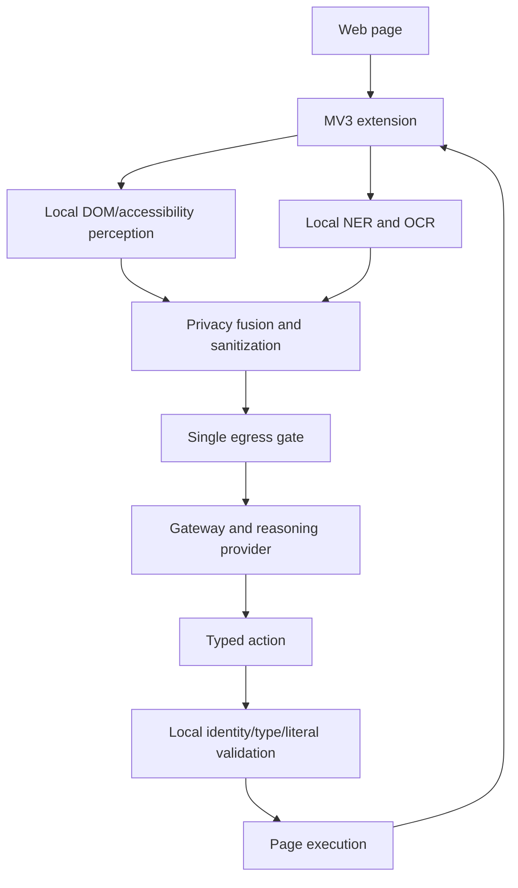

# GlassWall

GlassWall is a privacy-first browser agent that uses on-device perception to complete web tasks without exposing sensitive values to the reasoning model.

The project explores a simple separation: the agent can understand that a page contains an email address, address, or identifier without needing to see the value itself. Sensitive values are detected and stored locally, replaced with typed handles in the agent context, and resolved only when a validated action is executed in the page.

## Why GlassWall?

Browser agents commonly send screenshots, page structure, and form context to a remote model. That context can contain the very data the agent is being asked to protect.

GlassWall keeps perception and sensitive-value handling on the device. A reasoning provider receives sanitized structure and, when the policy allows it, a locally redacted screenshot. The browser validates the returned action before it runs.

This is a research and engineering project, not a claim that arbitrary websites or arbitrary models are safe by default.

## How it works



- The content script extracts page structure and accessibility context without reading input values, HTML, cookies, or browser storage.
- The offscreen document runs NER and, in the balanced policy, OCR over unexplained pixel regions. OCR text remains local.
- The privacy layer combines recognizer, DOM, NER, and OCR evidence. Values are placed in a session-only vault and represented outside the browser as typed handles such as `⟦EMAIL#1⟧`.
- The egress gate validates the complete request and constructs the only payload accepted by the extension network module.
- The gateway asks a configured provider for the next action. The extension checks observation freshness, element identity, action compatibility, vault type compatibility, and literal leakage before execution.

## Privacy model

Sensitive values and raw OCR output stay in the extension process. A value may leave the device only if an explicit implementation path outside this project is added; the current reasoning request contains sanitized text, typed handles, and—under `BALANCED`—a pixel-redacted PNG.

The default `STRICT` policy never captures pixels. `BALANCED` captures the visible tab, redacts fused sensitive regions locally, downsizes it, and sends only the redacted image. If local perception fails, the system degrades toward more masking rather than treating the region as safe.

The vault uses `chrome.storage.session` in the extension. A handle is resolved only for a matching target element and sensitivity class. The returned literal is passed to the page executor and is not sent to the gateway, logged, or included in the audit record. High-risk actions such as payment, deletion, and configured navigation can require confirmation.

These controls reduce the data exposed to the reasoning provider; they do not make an untrusted browser, website, model provider, or operating system fully secure.

## Repository layout

```text
apps/extension     Chrome MV3 extension: extraction, local inference, UI, orchestration
apps/backend       Fastify gateway and reasoning-provider adapters
apps/bench-site    Local synthetic sites used for repeatable browser tests
packages/schema    Shared Zod contracts for observations, actions, policy, and transport
packages/privacy   Recognizers, sanitization, vault, redaction policy, and egress gate
packages/inference Local NER/OCR wrappers and model runtime setup
packages/perception Observation and geometry helpers
eval               Playwright harness, leakage canary, tasks, and metrics
ml                 Model-vendoring script and exported model assets
config/policies    STRICT, BALANCED, and PERMISSIVE policy profiles
docs               Architecture, security, privacy, evaluation, and decision records
```

## Tech stack

- TypeScript, pnpm workspaces, Turbo, and Vitest
- Chrome/Chromium Manifest V3 with React side panel
- Transformers.js and ONNX Runtime Web for local NER
- Tesseract.js for local OCR
- Node.js and Fastify for the gateway
- OpenAI-compatible providers, Anthropic, and a deterministic scripted provider
- Playwright for browser smoke, leakage, and evaluation runs

## Running locally

### Prerequisites

- Node.js 20 or newer
- pnpm 9
- Chrome or Chromium
- About 200 MB available for locally vendored model/runtime assets

### Install and build

```bash
pnpm install
bash ml/fetch-models.sh
pnpm build
```

Model assets are downloaded into ignored extension assets. A fresh clone can run the scripted provider after model setup; model-backed NER/OCR requires the vendored assets.

### Configure the gateway

The gateway works without credentials by using the deterministic scripted planner. To use a hosted or local reasoning provider:

```bash
cp apps/backend/.env.example apps/backend/.env
```

Set the provider variables documented in that file. An OpenAI-compatible endpoint can be Ollama, vLLM, or a hosted compatible API. Keep API keys in the ignored `.env` file.

### Start the demo environment

```bash
pnpm dev
```

This starts the synthetic sites at `http://localhost:5173` and the gateway at `http://localhost:3000`.

Load the extension from `chrome://extensions` with Developer mode enabled, choose **Load unpacked**, and select `apps/extension/dist`. Open `http://localhost:5173/shoplite/checkout`, open the GlassWall side panel, and start the prefilled task. The panel shows the trace and privacy state; the local bench sites make it possible to inspect the complete flow without depending on a third-party website.

## Development and verification

```bash
pnpm build
pnpm typecheck
pnpm test
pnpm lint
pnpm verify:boundary
```

Useful browser/evaluation commands, with the bench site and gateway running:

```bash
pnpm build:eval       # evaluation extension plus the intentional unsafe control build
pnpm bench:smoke      # short Chromium smoke run
pnpm bench:all        # task matrix in STRICT and BALANCED
pnpm bench:leakage    # encoded-value leakage canary and negative control
pnpm bench:report     # regenerate eval/reports/summary.md
```

`verify:boundary` checks the single extension fetch site, forbidden browser APIs, manifest network policy, session-only vault storage, and the value-blind extractor. The unsafe build is for the leakage harness only and must never be loaded as the normal extension.

## Testing and measured evaluation

The checked-in evaluation report records a Chromium run on an Apple M1 with seed `1337`, covering the synthetic ShopLite, GovPortal, and ClinicDesk sites in both policies:

| Measurement | Recorded result |
|---|---:|
| Visual context recall / precision | 97.8% / 99.7% |
| PII detection recall / precision | 100.0% / 97.7% |
| Wire leaks in the run | 0 |
| Redaction precision | 95.6% |
| Local compute per step | 1059 ms |
| Payload size, p50 | 42.1 KB |
| Step latency, p50 / p95 | 3446 ms / 4666 ms |
| Task completion | 11/11 |

These are measurements of the current synthetic benchmark, not permanent guarantees or coverage of arbitrary websites. See [`eval/reports/summary.md`](eval/reports/summary.md) and [`EVALUATION.md`](EVALUATION.md) for definitions and reproduction details.

## Design decisions

- **Perception runs locally** so the raw page and pixel data do not need to be the model's input.
- **Typed handles replace values** so the planner can select the right kind of value without receiving the value.
- **One egress checkpoint** makes the privacy boundary auditable and testable instead of relying on every caller to sanitize correctly.
- **Local action validation** treats model output as an untrusted proposal and binds it to a fresh observation and compatible target.
- **Provider abstraction** keeps the browser contract independent from a hosted API, local model server, or deterministic test planner.

More detail is in [`docs/decisions/`](docs/decisions/), [`ARCHITECTURE.md`](ARCHITECTURE.md), and [`PRIVACY.md`](PRIVACY.md).

## Limitations

- Chrome/Chromium is supported; Firefox would require a different local-inference host because this build uses an offscreen document.
- The project does not include a trained face or general visual-PII detector. Unexplained image regions are conservatively masked.
- Cross-origin iframe controls cannot be inspected by the content script.
- OCR adds noticeable latency in `BALANCED` mode and depends on locally available model assets.
- The reasoning provider still determines task quality. The scripted provider is deterministic but intentionally limited to common semantic form/search flows.
- The current benchmark uses synthetic pages and does not establish reliability on arbitrary production sites.
- Navigation validation currently relies on same-origin constraints in the extension loop; navigation action semantics remain a hardening area.

## Roadmap

- [x] Local DOM/accessibility perception with value-blind extraction
- [x] Local NER/OCR pipeline with policy-controlled screenshot redaction
- [x] Session vault, typed handles, single egress gate, and action validation
- [x] Provider abstraction, deterministic fallback, browser harness, and leakage canary
- [ ] Improve visual-PII detection beyond conservative opaque-region masking
- [ ] Tighten navigation action validation and broaden real-site compatibility
- [ ] Reduce local model footprint and first-run setup cost

## Origin

GlassWall began as a hackathon prototype and evolved into an independent project focused on privacy-preserving browser agents. The active documentation describes the current system; historical planning material is kept under [`docs/archive/`](docs/archive/) for context.

## License

The repository currently does not include a license file. Add a license before distributing derivative work or accepting outside contributions once the ownership terms are settled.
